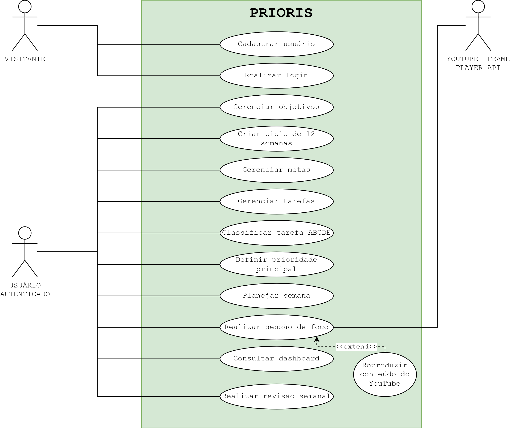

# PRIORIS
## Documentos de Requisitos

Sistema Web de Produtividade, Foco e Gestão de Prioridades

Versão 1.0

---

## 1. Visão Geral
O Prioris é uma aplicação web de produtividade pessoal voltada à organização,
priorização e execução de tarefas metas e objetivos.

A proposta do sistema é auxiliar o usuário não apenas a registrar atividades,
mas também a identificar aquilo que realmente merece a sua atenção, estabelecer
prioridades e acompanhar a sua evolução ao longo do tempo.

O Prioris utiliza como referências conceituais princípios de produtividade,
priorização e execução apresentados nos livros "Comece pelo mais difícil",
de Brian Tracy, e "1 Ano em 12 Semanas", de Brian P. Moran e Michael Linnington.

Entre os principais recursos previstos estão o gerenciamento de objetivos,
metas e tarefas, definição da prioridade principal do dia, classificação de
tarefas, planejamento em ciclos de 12 semanas, planejamento semanal,
temporizador de foco, acompanhamento do progresso e revisão periódica dos resultados.
## 2. Situação-Problema
Estudantes, trabalhadores e profissionais autônomos frequentemente precisam 
conciliar diferentes responsabilidades, como estudos, trabalho, projetos pessoais,
compromissos, prazos e objetivos de médio e longo prazo.

Mesmo utilizando agendas, litas de tarefas, calendários, aplicativos de
produtividade e outras ferramentas de organização, muitas pessoas ainda têm
dificuldade para determinar quais atividades são realmente prioritárias e como
as suas tarefas diárias contribuem para objetivos maiores.

Além disso, essas informações costumam estar distribuídas entre diferentes
ferramentas, dificultando o acompanhamento doprogresso e aumentando a
possibilidade de procrastinação, perda de foco, acúmulo de tarefas e execução
de atividades de baixo impacto.

Dessa forma, identifica-se a necessidade de uma solução que permita organizar
objetivos, metas e tarefas em um único ambiente, auxiliando o usuário a
estabelecer prioridades, executar atividades de forma focada e acompanhar a sua
evolução ao longo do tempo.
## 3. Justificativa
O desenvolvimento do Prioris justifica-se pela necessidade de oferecer uma
forma mais integrada de organizar responsabilidades e transformar objetivos
em ações concretas.

Muitas ferramentas de produtividade concentram-se principalmente no registro
de tarefas. Entretanto, possuir uma lista de atividades não significa
necessariamente saber quais delas devem ser executadas primeiro ou quais
contribuem de maneira mais significativa para os objetivos do usuário.

O Prioris propõe integrar planejamento, priorização, execução e acompanhamento
em um único sistema. Para isso, será utilizada uma estrutura que relaciona
objetivos de longo prazo, ciclos de planejamento, metas, tarefas e sessões de
foco.

A aplicação também possibilita a aplicação prática de conhecimentos
desenvolvidos durante o curso de Programação de Sistemas, envolvendo coleta
de requisitos, modelagem de dados, banco de dados relacional, desenvolvimento
de API REST, front-end, testes, documentação e versionamento de código.
## 4. Público-Alvo
O Prioris é destinado a pessoas que precisam organizar diferentes
responsabilidades e desejam melhorar sua capacidade de planejamento,
priorização e execução.

O público-alvo inclui principalmente:

- estudantes;
- universitários;
- trabalhadores;
- profissionais autônomos;
- pessoas que trabalham e estudam simultaneamente;
- pessoas que possuem projetos pessoais ou profissionais;
- usuários interessados em métodos de produtividade e gestão do tempo.

O sistema será desenvolvido de forma que o usuário não precise conhecer
previamente metodologias específicas de produtividade para utilizar seus
principais recursos.
## 5. Objetivo Geral
Desenvolver uma aplicação web de produtividade que auxilie usuários na
organização de objetivos, metas e tarefas, na definição de prioridades, na
execução de atividades com maior foco e no acompanhamento da sua evolução
ao longo do tempo.
## 6. Objetivos Específicos
- Permitir o cadastro e gerenciamento de usuários.

- Possibilitar a criação e o acompanhamento de objetivos pessoais e
  profissionais.

- Permitir a organização dos objetivos em ciclos de planejamento de
  12 semanas.

- Possibilitar a criação de metas e ações relacionadas aos objetivos.

- Permitir o cadastro, edição, conclusão e exclusão de tarefas.

- Possibilitar a classificação e priorização das tarefas.

- Permitir que o usuário identifique sua principal prioridade diária.

- Disponibilizar um temporizador de foco configurável para auxiliar na
  execução das tarefas.

- Registrar as sessões de foco realizadas pelo usuário.

- Disponibilizar um planejamento semanal relacionado aos objetivos do
  ciclo atual.

- Apresentar indicadores de execução e progresso.

- Permitir a realização de revisões periódicas do planejamento.

- Apresentar ao usuário uma visão centralizada de suas atividades e
  progresso através de um dashboard.

- Desenvolver uma API REST responsável pelas regras de negócio e pela
  comunicação com o banco de dados.

- Implementar uma interface web responsiva que consuma os dados da API.

- Aplicar boas práticas de modelagem, segurança, testes, documentação e
  versionamento de código.
## 7. Escopo do Sistema
### 7.1 Escopo da primeira versão

A primeira versão do Prioris deverá contemplar:

- cadastro e autenticação básica de usuários;
- cadastro e gerenciamento de objetivos;
- planejamento em ciclos de 12 semanas;
- cadastro e gerenciamento de metas;
- cadastro e gerenciamento de tarefas;
- classificação e priorização de tarefas;
- definição da prioridade principal do dia;
- planejamento semanal;
- acompanhamento das tarefas concluídas;
- temporizador de foco configurável;
- reprodução de vídeos ou playlists de concentração do YouTube durante as sessões de foco;
- controles básicos de reprodução e volume integrados ao modo foco;
- registro de sessões de foco;
- dashboard com informações resumidas;
- indicadores básicos de execução e progresso;
- histórico básico das atividades realizadas.

### 7.2 Funcionalidades previstas para evolução futura

Poderão ser incorporadas em versões futuras:

- integração com Google Calendar;
- integração com Spotify;
- integração com Apple Music;
- integração com APIs externas de livros;
- módulo completo de acompanhamento de leitura;
- notificações push;
- assistente de Inteligência Artificial;
- recomendações automáticas de priorização;
- planejamento diário auxiliado por IA;
- análises avançadas de produtividade;
- gamificação;
- versão mobile ou PWA.
## 8. Atores

### 8.1 Visitante

Pessoa que acessa o Prioris sem estar autenticada.

Principais ações:

- visualizar a tela inicial;
- cadastrar uma nova conta;
- realizar login no sistema.

### 8.2 Usuário Autenticado

Pessoa cadastrada que realizou autenticação no Prioris.

É o principal ator do sistema e poderá:

- gerenciar seus objetivos;
- criar ciclos de planejamento de 12 semanas;
- cadastrar metas;
- cadastrar e organizar tarefas;
- classificar prioridades;
- definir a principal prioridade do dia;
- planejar a semana;
- realizar sessões de foco;
- acompanhar seu progresso;
- consultar seu histórico;
- realizar revisões periódicas.

Cada usuário deverá acessar somente as informações vinculadas à própria conta.

### 8.3 YouTube IFrame Player API

Serviço externo utilizado pelo Prioris para reproduzir vídeos ou playlists
de concentração durante as sessões de foco.

A integração permitirá controlar funcionalidades básicas de reprodução,
como iniciar, pausar e ajustar o volume do conteúdo exibido no player.
## 9. Requisitos Funcionais
Os requisitos funcionais representam as funcionalidades que o sistema deverá
oferecer aos seus usuários.

As prioridades utilizadas serão:

- Alta: funcionalidade essencial para o funcionamento da primeira versão;
- Média: funcionalidade importante para a experiência proposta;
- Baixa: funcionalidade complementar que poderá ser simplificada caso
  necessário.

| ID | Tipo | Descrição | Prioridade |
|---|---|---|---|
| RF-001 | Funcional | O sistema deverá permitir que um visitante cadastre uma nova conta informando seus dados obrigatórios. | Alta |
| RF-002 | Funcional | O sistema deverá permitir que um usuário cadastrado realize login. | Alta |
| RF-003 | Funcional | O sistema deverá permitir que o usuário autenticado encerre sua sessão por meio da função de logout. | Alta |
| RF-004 | Funcional | O sistema deverá permitir que o usuário cadastre, visualize, edite e exclua seus objetivos. | Alta |
| RF-005 | Funcional | O sistema deverá permitir que o usuário classifique seus objetivos por áreas de interesse, como carreira, finanças, saúde, desenvolvimento pessoal ou profissional, família e área social/comunitária. | Média |
| RF-006 | Funcional | O sistema deverá permitir que o usuário registre uma descrição, prazo e motivo pelo qual determinado objetivo é importante. | Média |
| RF-007 | Funcional | O sistema deverá permitir que o usuário crie ciclos de planejamento com duração de 12 semanas. | Alta |
| RF-008 | Funcional | O sistema deverá permitir associar objetivos a um ciclo de 12 semanas. | Alta |
| RF-009 | Funcional | O sistema deverá apresentar a data inicial, data final e semana atual de cada ciclo. | Média |
| RF-010 | Funcional | O sistema deverá permitir acompanhar o progresso dos objetivos definidos para o ciclo de 12 semanas. | Média |
| RF-011 | Funcional | O sistema deverá permitir cadastrar, visualizar, editar e excluir metas relacionadas aos objetivos. | Alta |
| RF-012 | Funcional | O sistema deverá permitir definir prazo e status para cada meta. | Alta |
| RF-013 | Funcional | O sistema deverá apresentar o progresso das metas a partir das tarefas relacionadas. | Média |
| RF-014 | Funcional | O sistema deverá permitir que o usuário cadastre, visualize, edite e exclua tarefas. | Alta |
| RF-015 | Funcional | O sistema deverá permitir associar uma tarefa a uma meta ou objetivo. | Alta |
| RF-016 | Funcional | O sistema deverá permitir definir data, prazo, descrição e tempo estimado para uma tarefa. | Alta |
| RF-017 | Funcional | O sistema deverá permitir marcar uma tarefa como concluída. | Alta |
| RF-018 | Funcional | O sistema deverá manter as tarefas concluídas disponíveis no histórico do usuário. | Média |
| RF-019 | Funcional | O sistema deverá permitir classificar tarefas utilizando a metodologia ABCDE. | Alta |
| RF-020 | Funcional | O sistema deverá identificar visualmente tarefas classificadas como A, B, C, D ou E. | Média |
| RF-021 | Funcional | O sistema deverá permitir que o usuário defina uma tarefa como sua prioridade principal do dia. | Alta |
| RF-022 | Funcional | O sistema deverá destacar visualmente a prioridade principal do dia no dashboard. | Alta |
| RF-023 | Funcional | O sistema deverá disponibilizar perguntas reflexivas para auxiliar o usuário na escolha de sua prioridade principal. | Média |
| RF-024 | Funcional | O sistema deverá permitir que o usuário organize tarefas estratégicas em um planejamento semanal. | Alta |
| RF-025 | Funcional | O sistema deverá permitir relacionar o planejamento semanal ao ciclo de 12 semanas ativo. | Média |
| RF-026 | Funcional | O sistema deverá apresentar as tarefas estratégicas previstas para cada semana do ciclo. | Média |
| RF-027 | Funcional | O sistema deverá disponibilizar um temporizador para realização de sessões de foco. | Alta |
| RF-028 | Funcional | O sistema deverá permitir que o usuário configure a duração do período de foco e do período de descanso. | Alta |
| RF-029 | Funcional | O sistema deverá permitir iniciar uma sessão de foco vinculada a uma tarefa. | Alta |
| RF-030 | Funcional | O sistema deverá permitir pausar, retomar e encerrar uma sessão de foco. | Alta |
| RF-031 | Funcional | O sistema deverá registrar o tempo dedicado às sessões de foco. | Alta |
| RF-032 | Funcional | O sistema deverá permitir reproduzir vídeos ou playlists do YouTube durante uma sessão de foco. | Média |
| RF-033 | Funcional | O sistema deverá disponibilizar controles básicos de reprodução e volume do conteúdo utilizado no modo foco. | Média |
| RF-034 | Funcional | O sistema deverá sincronizar o comportamento básico do player com a sessão de foco, permitindo pausar a reprodução quando a sessão for pausada ou encerrada. | Média |
| RF-035 | Funcional | O sistema deverá disponibilizar um dashboard com informações resumidas sobre a rotina do usuário. | Alta |
| RF-036 | Funcional | O dashboard deverá apresentar a prioridade principal do dia. | Alta |
| RF-037 | Funcional | O dashboard deverá apresentar informações sobre tarefas planejadas e concluídas. | Alta |
| RF-038 | Funcional | O dashboard deverá apresentar o tempo de foco registrado pelo usuário. | Média |
| RF-039 | Funcional | O dashboard deverá apresentar informações resumidas sobre o ciclo de 12 semanas ativo. | Média |
| RF-040 | Funcional | O sistema deverá calcular um indicador de execução com base nas ações estratégicas planejadas e efetivamente concluídas pelo usuário. | Média |
| RF-041 | Funcional | O sistema deverá apresentar o indicador de execução semanal ao usuário. | Média |
| RF-042 | Funcional | O sistema deverá permitir que o usuário realize uma revisão semanal de seu planejamento. | Média |
| RF-043 | Funcional | A revisão semanal deverá apresentar tarefas planejadas, tarefas concluídas, score de execução e progresso do ciclo. | Média |
| RF-044 | Funcional | O sistema deverá permitir registrar observações pessoais sobre o desempenho da semana. | Baixa |
| RF-045 | Funcional | O sistema deverá permitir consultar o histórico básico de atividades e revisões anteriores. | Média |
## 10. Requisitos Não Funcionais
Os requisitos não funcionais definem características de qualidade,
segurança, desempenho, usabilidade, compatibilidade e manutenção do sistema.

| ID | Tipo | Descrição | Prioridade |
|---|---|---|---|
| RNF-001 | Não Funcional | A aplicação deverá possuir interface responsiva, adaptando-se adequadamente a computadores, tablets e smartphones. | Alta |
| RNF-002 | Não Funcional | A interface deverá possuir navegação intuitiva, organização visual consistente e mensagens compreensíveis ao usuário. | Alta |
| RNF-003 | Não Funcional | O front-end deverá consumir os dados do back-end por meio de requisições HTTP à API REST. | Alta |
| RNF-004 | Não Funcional | A API deverá retornar dados em formato JSON. | Alta |
| RNF-005 | Não Funcional | O sistema deverá utilizar corretamente os códigos de status HTTP conforme o resultado das operações realizadas. | Alta |
| RNF-006 | Não Funcional | Os dados recebidos pela API deverão ser validados antes de serem persistidos no banco de dados. | Alta |
| RNF-007 | Não Funcional | O sistema deverá possuir tratamento centralizado de erros no back-end. | Alta |
| RNF-008 | Não Funcional | As senhas dos usuários não deverão ser armazenadas em texto puro no banco de dados. | Alta |
| RNF-009 | Não Funcional | Cada usuário autenticado deverá acessar somente os dados vinculados à própria conta. | Alta |
| RNF-010 | Não Funcional | Credenciais, chaves de APIs e informações sensíveis deverão ser armazenadas em variáveis de ambiente e não poderão ser versionadas no GitHub. | Alta |
| RNF-011 | Não Funcional | O banco de dados deverá garantir integridade referencial entre as entidades através de chaves estrangeiras e constraints. | Alta |
| RNF-012 | Não Funcional | O código deverá ser organizado em camadas, separando responsabilidades de controle, regras de negócio e acesso aos dados. | Alta |
| RNF-013 | Não Funcional | A aplicação deverá apresentar mensagens visuais de carregamento, sucesso, erro e ausência de dados sempre que necessário. | Média |
| RNF-014 | Não Funcional | O sistema deverá funcionar nos navegadores modernos utilizados em computadores e dispositivos móveis. | Média |
| RNF-015 | Não Funcional | O funcionamento das funcionalidades principais não deverá depender da disponibilidade da integração com o YouTube. | Média |
| RNF-016 | Não Funcional | Falhas na reprodução de conteúdo externo não deverão impedir o funcionamento do temporizador ou o registro da sessão de foco. | Média |
| RNF-017 | Não Funcional | Os endpoints da API deverão ser documentados utilizando OpenAPI/Swagger. | Alta |
| RNF-018 | Não Funcional | Todos os endpoints da API deverão possuir testes de cenários válidos e inválidos. | Alta |
| RNF-019 | Não Funcional | O projeto deverá possuir histórico de versionamento utilizando Git e GitHub. | Alta |
| RNF-020 | Não Funcional | O código deverá possuir estrutura que permita manutenção e inclusão futura de novas funcionalidades. | Média |
## 11. Regras de Negócio
As regras de negócio definem condições e restrições que deverão ser
respeitadas durante o funcionamento do Prioris.
### Usuários

**RN-001 — Exclusividade dos dados**

Todo objetivo, ciclo, meta, tarefa, sessão de foco e registro de progresso
deverá estar vinculado ao usuário responsável por sua criação.

**RN-002 — Privacidade**

Um usuário não poderá visualizar, editar ou excluir informações pertencentes
a outro usuário.

**RN-003 — E-mail único**

Não poderão existir duas contas cadastradas com o mesmo endereço de e-mail.
### Objetivos

**RN-004 — Áreas dos objetivos**

Um objetivo poderá ser associado a uma área da vida ou interesse definida
pelo sistema ou pelo usuário.

Entre as categorias iniciais poderão estar:

- carreira;
- família;
- finanças;
- saúde;
- desenvolvimento pessoal ou profissional;
- social ou comunitário.

**RN-005 — Propósito do objetivo**

O usuário poderá registrar por que determinado objetivo é importante,
permitindo relacionar suas ações diárias a um propósito maior.
### Ciclos de 12 semanas

**RN-006 — Duração do ciclo**

Um ciclo padrão de planejamento terá duração de 12 semanas consecutivas.

**RN-007 — Período do ciclo**

O sistema deverá calcular a data final do ciclo a partir de sua data de início.

**RN-008 — Semana atual**

Enquanto um ciclo estiver em andamento, o sistema deverá identificar
automaticamente em qual das 12 semanas o usuário se encontra.

**RN-009 — Objetivos do ciclo**

Um ciclo deverá possuir pelo menos um objetivo associado para ser considerado
um ciclo de planejamento ativo.

**RN-010 — Histórico dos ciclos**

Após o encerramento de um ciclo, seus dados deverão permanecer disponíveis
para consulta no histórico.
### Metas e tarefas

**RN-011 — Relação entre planejamento e execução**

Uma meta poderá ser vinculada a um objetivo, e uma tarefa poderá ser
vinculada a uma meta ou diretamente a um objetivo.

**RN-012 — Status da tarefa**

Uma tarefa deverá possuir um estado que permita identificar se está
pendente ou concluída.

**RN-013 — Histórico de conclusão**

Quando uma tarefa for concluída, ela não deverá desaparecer dos registros
do sistema, permanecendo disponível no histórico.

**RN-014 — Prazo**

Quando informado, o prazo de uma tarefa deverá possuir uma data válida.

**RN-015 — Tempo estimado**

O tempo estimado de uma tarefa, quando informado, deverá possuir valor
positivo.
### Prioridade Principal do Dia

**RN-019 — Prioridade única**

O usuário poderá possuir apenas uma tarefa definida como prioridade principal
para cada dia.

**RN-020 — Substituição da prioridade**

Caso o usuário escolha outra tarefa como prioridade principal no mesmo dia,
a definição anterior deverá ser substituída.

**RN-021 — Tarefa válida**

Somente uma tarefa ativa e pertencente ao usuário poderá ser definida como
prioridade principal.

**RN-022 — Perguntas de priorização**

O sistema poderá apresentar perguntas reflexivas para auxiliar o usuário na
identificação de sua principal prioridade.

As perguntas deverão considerar aspectos relacionados a impacto,
responsabilidade pessoal e importância da tarefa.
### Planejamento semanal

**RN-023 — Planejamento estratégico**

O planejamento semanal deverá priorizar ações relacionadas aos objetivos
e metas do ciclo ativo.

**RN-024 — Relação com o ciclo**

As ações estratégicas de uma semana poderão estar relacionadas ao ciclo de
12 semanas em andamento.

**RN-025 — Continuidade**

Tarefas não concluídas poderão ser reagendadas, desde que o usuário tome
essa decisão explicitamente.
### Score de Execução

**RN-026 — Cálculo do score semanal**

O Score de Execução semanal deverá representar a relação entre as ações
estratégicas planejadas para a semana e aquelas efetivamente concluídas.

O cálculo básico será:

Score de Execução =
(ações estratégicas concluídas / ações estratégicas planejadas) × 100

**RN-027 — Semana sem ações planejadas**

Caso não existam ações estratégicas planejadas para determinada semana,
o sistema não deverá apresentar um percentual de execução como se fosse zero.

Nesse caso, deverá informar que não existem dados suficientes para calcular
o indicador.

**RN-028 — Histórico do score**

Os resultados semanais deverão permanecer disponíveis para consulta e
comparação com semanas anteriores.
### Sessões de foco

**RN-029 — Configuração da sessão**

O usuário deverá definir ou utilizar valores previamente configurados para
o tempo de foco e de descanso.

**RN-030 — Duração válida**

Os tempos configurados para foco e descanso deverão possuir valores maiores
que zero.

**RN-031 — Associação com tarefa**

Uma sessão de foco poderá ser vinculada a uma tarefa pertencente ao usuário.

**RN-032 — Registro da sessão**

Somente sessões efetivamente iniciadas poderão gerar registros de foco.

**RN-033 — Sessão interrompida**

Caso uma sessão seja encerrada antes do tempo previsto, o sistema poderá
registrar o tempo efetivamente utilizado, identificando que a sessão não foi
finalizada normalmente.

**RN-034 — Independência do temporizador**

O temporizador deverá continuar funcionando independentemente da
disponibilidade do conteúdo reproduzido pelo YouTube.
### Integração com YouTube

**RN-035 — Reprodução incorporada**

O conteúdo do YouTube deverá ser reproduzido por meio de integração oficial
com o player incorporado.

**RN-036 — Controle durante o foco**

Quando possível, ao pausar ou encerrar a sessão de foco, o sistema deverá
pausar também a reprodução associada àquela sessão.

**RN-037 — Falha de serviço externo**

Caso o conteúdo do YouTube esteja indisponível, o usuário deverá continuar
podendo utilizar normalmente as demais funcionalidades do modo foco.
### Dashboard e histórico

**RN-038 — Dados reais**

Os indicadores apresentados no dashboard deverão ser calculados a partir dos
dados efetivamente registrados no sistema.

**RN-039 — Progresso das tarefas**

O percentual de conclusão de tarefas deverá considerar as tarefas planejadas
e efetivamente concluídas dentro do período analisado.

**RN-040 — Histórico**

Registros históricos relevantes não deverão ser alterados automaticamente
apenas porque o usuário iniciou um novo ciclo ou uma nova semana.
## 12. Histórias de Usuário

**As histórias de** usuário descrevem funcionalidades do Prioris a partir da perspectiva de quem utilizará o sistema.

A estrutura utilizada será:

**Como [ator], quero [ação], para [benefício ou objetivo].**

### HU-001 — Criar conta

**Como** visitante,
**quero** criar uma conta no Prioris,
**para** utilizar as funcionalidades personalizadas do sistema.

**Requisitos relacionados:** RF-001.

---

### HU-002 — Realizar login

**Como** usuário cadastrado,
**quero** realizar login no Prioris,
**para** acessar meus objetivos, tarefas e demais informações pessoais.

**Requisitos relacionados:** RF-002 e RF-003.

---

### HU-003 — Gerenciar objetivos

**Como** usuário autenticado,
**quero** cadastrar e acompanhar meus objetivos,
**para** manter clareza sobre aquilo que desejo alcançar.

**Requisitos relacionados:** RF-004, RF-005 e RF-006.

---

### HU-004 — Planejar um ciclo de 12 semanas

**Como** usuário autenticado,
**quero** criar um ciclo de planejamento de 12 semanas e associar objetivos a ele,
**para** transformar objetivos de longo prazo em períodos menores de execução.

**Requisitos relacionados:** RF-007, RF-008, RF-009 e RF-010.

---

### HU-005 — Gerenciar metas

**Como** usuário autenticado,
**quero** dividir meus objetivos em metas menores,
**para** acompanhar de maneira mais clara o caminho necessário para alcançá-los.

**Requisitos relacionados:** RF-011, RF-012 e RF-013.

---

### HU-006 — Gerenciar tarefas

**Como** usuário autenticado,
**quero** cadastrar, editar, concluir e excluir tarefas,
**para** organizar as ações que preciso executar.

**Requisitos relacionados:** RF-014, RF-015, RF-016, RF-017 e RF-018.

---

### HU-007 — Classificar tarefas pelo método ABCDE

**Como** usuário autenticado,
**quero** classificar minhas tarefas utilizando o método ABCDE,
**para** diferenciar atividades importantes, adiáveis, delegáveis ou elimináveis.

**Requisitos relacionados:** RF-019 e RF-020.

---

### HU-008 — Definir minha prioridade principal

**Como** usuário autenticado,
**quero** escolher uma tarefa como minha prioridade principal do dia,
**para** concentrar meus esforços na atividade que possui maior importância naquele momento.

**Requisitos relacionados:** RF-021, RF-022 e RF-023.

---

### HU-009 — Planejar minha semana

**Como** usuário autenticado,
**quero** selecionar as ações estratégicas que deverão ser executadas durante a semana,
**para** manter minhas atividades alinhadas aos objetivos do ciclo de 12 semanas.

**Requisitos relacionados:** RF-024, RF-025 e RF-026.

---

### HU-010 — Realizar uma sessão de foco

**Como** usuário autenticado,
**quero** iniciar uma sessão de foco vinculada a uma tarefa,
**para** trabalhar nela durante um período determinado sem perder a concentração.

**Requisitos relacionados:** RF-027, RF-028, RF-029, RF-030 e RF-031.

---

### HU-011 — Utilizar conteúdo de concentração

**Como** usuário autenticado,
**quero** reproduzir vídeos ou playlists de concentração durante uma sessão de foco,
**para** criar um ambiente que favoreça minha concentração.

**Requisitos relacionados:** RF-032, RF-033 e RF-034.

---

### HU-012 — Consultar meu dashboard

**Como** usuário autenticado,
**quero** visualizar um resumo das minhas tarefas, prioridade, tempo de foco e progresso,
**para** compreender rapidamente minha situação atual.

**Requisitos relacionados:** RF-035, RF-036, RF-037, RF-038 e RF-039.

---

### HU-013 — Acompanhar meu Score de Execução

**Como** usuário autenticado,
**quero** visualizar meu Score de Execução semanal,
**para** verificar quanto das ações estratégicas planejadas eu realmente executei.

**Requisitos relacionados:** RF-040 e RF-041.

---

### HU-014 — Realizar revisão semanal

**Como** usuário autenticado,
**quero** revisar os resultados da minha semana,
**para** identificar avanços, dificuldades e ajustes necessários para a semana seguinte.

**Requisitos relacionados:** RF-042, RF-043 e RF-044.

---

### HU-015 — Consultar histórico

**Como** usuário autenticado,
**quero** consultar meus registros anteriores,
**para** acompanhar minha evolução ao longo do tempo.

**Requisitos relacionados:** RF-045.

---

# 13. Casos de Uso

### 13.1 Diagrama de Casos de Uso

O diagrama abaixo representa os principais atores e interações do sistema
Prioris.

Os casos de uso representam as principais interações realizadas entre os atores e o sistema.

## UC-001 — Cadastrar usuário

**Ator principal:** Visitante.

**Objetivo:** Criar uma nova conta no Prioris.

**Pré-condição:** O visitante não possuir conta cadastrada com o mesmo e-mail.

**Fluxo principal:**

1. O visitante acessa a opção de cadastro.
2. O sistema apresenta o formulário.
3. O visitante informa os dados obrigatórios.
4. O sistema valida as informações.
5. O sistema verifica se o e-mail já está cadastrado.
6. O sistema registra o novo usuário.
7. O sistema informa que o cadastro foi realizado com sucesso.

**Fluxos alternativos:**

* Caso existam campos obrigatórios inválidos, o sistema deverá informar o erro.
* Caso o e-mail já esteja cadastrado, o sistema não deverá criar uma nova conta.

**Pós-condição:** O usuário estará cadastrado no sistema.

---

## UC-002 — Realizar login

**Ator principal:** Usuário cadastrado.

**Objetivo:** Acessar a área autenticada do Prioris.

**Pré-condição:** Possuir uma conta cadastrada.

**Fluxo principal:**

1. O usuário acessa a tela de login.
2. Informa e-mail e senha.
3. O sistema valida as credenciais.
4. O sistema autentica o usuário.
5. O sistema direciona o usuário ao dashboard.

**Fluxo alternativo:**

* Caso as credenciais sejam inválidas, o sistema informa que não foi possível realizar a autenticação.

**Pós-condição:** O usuário estará autenticado.

---

## UC-003 — Gerenciar objetivos

**Ator principal:** Usuário autenticado.

**Objetivo:** Criar e manter objetivos pessoais ou profissionais.

**Pré-condição:** O usuário deverá estar autenticado.

**Fluxo principal:**

1. O usuário acessa a área de objetivos.
2. O sistema apresenta seus objetivos existentes.
3. O usuário escolhe cadastrar um novo objetivo.
4. Informa os dados solicitados.
5. O sistema valida e registra o objetivo.
6. O objetivo passa a ser apresentado na listagem.

**Fluxos alternativos:**

* O usuário poderá editar um objetivo existente.
* O usuário poderá excluir um objetivo quando permitido pelas regras do sistema.

**Pós-condição:** As alterações realizadas estarão persistidas no banco de dados.

---

## UC-004 — Criar ciclo de 12 semanas

**Ator principal:** Usuário autenticado.

**Objetivo:** Criar um período estruturado de execução.

**Pré-condição:** O usuário deverá estar autenticado.

**Fluxo principal:**

1. O usuário acessa a área de ciclos.
2. Seleciona a opção para criar um novo ciclo.
3. Informa a data de início.
4. Define os objetivos associados ao ciclo.
5. O sistema calcula o período de 12 semanas.
6. O sistema registra o ciclo.
7. O sistema apresenta as informações do novo ciclo.

**Pós-condição:** Um novo ciclo de planejamento estará disponível ao usuário.

---

## UC-005 — Gerenciar tarefas

**Ator principal:** Usuário autenticado.

**Objetivo:** Criar e administrar as tarefas que deverão ser executadas.

**Pré-condição:** O usuário deverá estar autenticado.

**Fluxo principal:**

1. O usuário acessa a área de tarefas.
2. Seleciona a opção de nova tarefa.
3. Informa título, descrição e demais informações desejadas.
4. O usuário poderá relacionar a tarefa a uma meta ou objetivo.
5. O sistema valida os dados.
6. O sistema registra a tarefa.
7. A nova tarefa passa a ser apresentada na listagem.

**Fluxos alternativos:**

* O usuário poderá editar a tarefa.
* O usuário poderá marcar a tarefa como concluída.
* O usuário poderá excluir ou descartar a tarefa conforme as regras do sistema.

**Pós-condição:** A alteração estará registrada no sistema.

---

## UC-006 — Classificar tarefa pelo método ABCDE

**Ator principal:** Usuário autenticado.

**Objetivo:** Definir a importância estratégica de uma tarefa.

**Pré-condição:** A tarefa deverá existir e pertencer ao usuário.

**Fluxo principal:**

1. O usuário seleciona uma tarefa.
2. Escolhe uma classificação entre A, B, C, D ou E.
3. O sistema registra a classificação.
4. O sistema apresenta a identificação visual correspondente.

**Pós-condição:** A tarefa ficará associada à classificação escolhida.

---

## UC-007 — Definir prioridade principal do dia

**Ator principal:** Usuário autenticado.

**Objetivo:** Definir qual tarefa deverá receber maior atenção no dia.

**Pré-condição:** Deverá existir pelo menos uma tarefa ativa.

**Fluxo principal:**

1. O usuário acessa suas tarefas do dia.
2. O sistema poderá apresentar perguntas de apoio à priorização.
3. O usuário seleciona uma tarefa.
4. Escolhe a opção de defini-la como prioridade principal.
5. O sistema verifica se já existe outra prioridade para o mesmo dia.
6. Caso exista, substitui a definição anterior mediante a ação do usuário.
7. A nova prioridade é destacada no dashboard.

**Pós-condição:** Existirá no máximo uma prioridade principal definida para aquela data.

---

## UC-008 — Planejar semana

**Ator principal:** Usuário autenticado.

**Objetivo:** Definir as ações estratégicas da semana.

**Pré-condição:** O usuário deverá possuir planejamento ou ciclo ativo.

**Fluxo principal:**

1. O usuário acessa o planejamento semanal.
2. O sistema apresenta informações relacionadas ao ciclo atual.
3. O usuário seleciona ou cria ações estratégicas para a semana.
4. As atividades são organizadas conforme o período definido.
5. O sistema salva o planejamento.

**Pós-condição:** O plano semanal estará disponível para orientar as atividades do usuário.

---

## UC-009 — Iniciar sessão de foco

**Ator principal:** Usuário autenticado.

**Ator secundário:** YouTube IFrame Player API.

**Objetivo:** Executar uma tarefa durante um período de concentração.

**Pré-condição:** O usuário deverá estar autenticado.

**Fluxo principal:**

1. O usuário acessa o modo foco.
2. Seleciona uma tarefa.
3. Define ou utiliza os tempos configurados de foco e descanso.
4. Opcionalmente seleciona conteúdo de concentração.
5. O usuário inicia a sessão.
6. O temporizador é iniciado.
7. Quando selecionado, o conteúdo do YouTube é reproduzido.
8. O usuário poderá pausar ou retomar a sessão.
9. Ao concluir ou encerrar a sessão, o sistema registra o tempo realizado.

**Fluxos alternativos:**

* Caso o conteúdo do YouTube esteja indisponível, o temporizador deverá continuar funcionando.
* Caso a sessão seja encerrada antecipadamente, o sistema poderá registrar o tempo efetivamente realizado.

**Pós-condição:** A sessão realizada estará registrada no histórico do usuário.

---

## UC-010 — Consultar dashboard

**Ator principal:** Usuário autenticado.

**Objetivo:** Visualizar informações resumidas sobre planejamento e execução.

**Pré-condição:** O usuário deverá estar autenticado.

**Fluxo principal:**

1. O usuário acessa o dashboard.
2. O sistema consulta os dados relacionados à conta.
3. O sistema apresenta a prioridade principal.
4. Apresenta tarefas planejadas e concluídas.
5. Apresenta informações do ciclo ativo.
6. Apresenta tempo de foco e indicadores disponíveis.

**Pós-condição:** Não há alteração de dados.

---

## UC-011 — Consultar Score de Execução

**Ator principal:** Usuário autenticado.

**Objetivo:** Avaliar o nível de execução do planejamento semanal.

**Pré-condição:** Existirem ações estratégicas planejadas para a semana.

**Fluxo principal:**

1. O usuário acessa seus indicadores.
2. O sistema identifica as ações estratégicas planejadas.
3. O sistema identifica quantas foram concluídas.
4. O sistema calcula o Score de Execução.
5. O percentual é apresentado ao usuário.

**Fluxo alternativo:**

* Caso não existam ações planejadas, o sistema deverá informar que não há dados suficientes para calcular o indicador.

**Pós-condição:** Não há alteração de dados.

---

## UC-012 — Realizar revisão semanal

**Ator principal:** Usuário autenticado.

**Objetivo:** Avaliar a execução da semana e preparar ajustes futuros.

**Pré-condição:** O usuário deverá possuir registros referentes à semana analisada.

**Fluxo principal:**

1. O usuário acessa a revisão semanal.
2. O sistema apresenta ações planejadas e concluídas.
3. O sistema apresenta o Score de Execução.
4. O sistema apresenta o progresso do ciclo.
5. O usuário registra suas observações sobre a semana.
6. O sistema salva a revisão.

**Pós-condição:** A revisão ficará disponível no histórico do usuário.