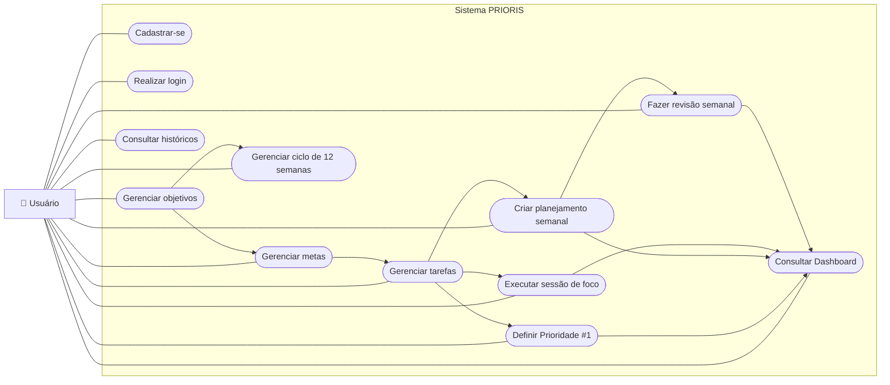

# Diagrama de Casos de Uso — PRIORIS

O diagrama abaixo apresenta o ator principal da V1 e os principais casos de uso.

## Leitura do diagrama

O **Usuário** é o ator principal da V1 do Prioris.

Ele interage com os módulos de cadastro/login, objetivos, metas, tarefas, Prioridade #1, ciclos, planejamento semanal, foco, revisão e Dashboard.

As setas internas indicam dependências conceituais do fluxo do sistema e não significam obrigatoriamente `include` ou `extend` da UML.
